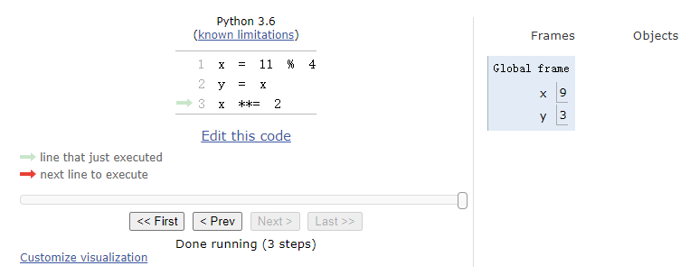
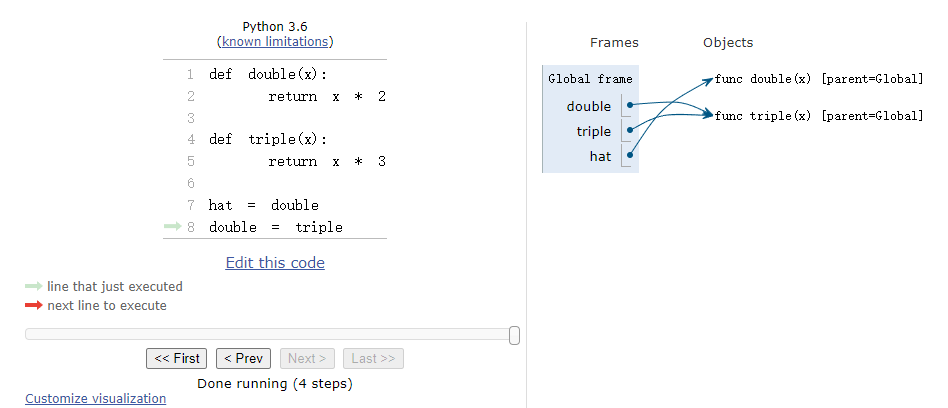
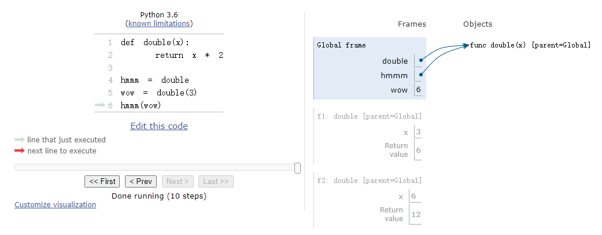
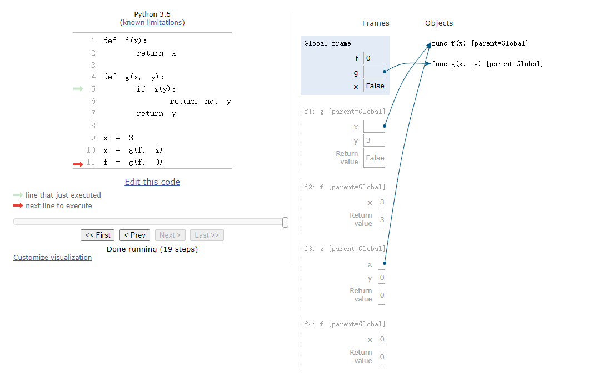

# CS61a DISC 1
# Control, Environment Diagrams
我的个人博客 <https://lipancake.tk/> 
(挂在github上，第一次打开很慢，但是排版好看)

Link to this section: <https://inst.eecs.berkeley.edu/~cs61a/fa21/disc/disc01/>

Run pythontutor link: <https://pythontutor.com/composingprograms.html#mode=edit>
## Q1: Jacket Weather?
Alfonso will only wear a jacket outside if it is below 60 degrees or it is raining.

Write a function that takes in the current temperature and a boolean value telling if it is raining. This function should return True if Alfonso will wear a jacket and False otherwise.

First, try solving this problem using an if statement.

::: code-tabs#Q1
@tab Question
```
def wears_jacket_with_if(temp, raining):
    """
    >>> wears_jacket_with_if(90, False)
    False
    >>> wears_jacket_with_if(40, False)
    True
    >>> wears_jacket_with_if(100, True)
    True
    """
    "*** YOUR CODE HERE ***"

```

@tab Answer
```
#Q1
def wears_jacket_with_if(temp, raining):
    """
    >>> wears_jacket_with_if(90, False)
    False
    >>> wears_jacket_with_if(40, False)
    True
    >>> wears_jacket_with_if(100, True)
    True
    """
    "*** YOUR CODE HERE ***"
    if temp < 60 or raining:
        return True
    else:
        return False


```

@tab Answer 2
```
return True if temp < 60 or raining else False
```
:::

## Q2: Case Conundrum
In this question, we will explore the difference between if and elif.

What is the result of evaluating the following code?

::: code-tabs#Q2
@tab Question
```
def special_case():
    x = 10
    if x > 0:
        x += 2
    elif x < 13:
        x += 3
    elif x % 2 == 1:
        x += 4
    return x

special_case()

def just_in_case():
    x = 10
    if x > 0:
        x += 2
    if x < 13:
        x += 3
    if x % 2 == 1:
        x += 4
    return x

just_in_case()

def case_in_point():
    x = 10
    if x > 0:
        return x + 2
    if x < 13:
        return x + 3
    if x % 2 == 1:
        return x + 4
    return x

case_in_point()

```

@tab Answer
```
# Q2
def special_case():
    x = 10
    if x > 0:
        x += 2
    elif x < 13:
        x += 3
    elif x % 2 == 1:
        x += 4
    return x

print(special_case()) # 12

def just_in_case():
    x = 10
    if x > 0:
        x += 2
    if x < 13:
        x += 3
    if x % 2 == 1:
        x += 4
    return x

print(just_in_case()) # 19

def case_in_point():
    x = 10
    if x > 0:
        return x + 2
    if x < 13:
        return x + 3
    if x % 2 == 1:
        return x + 4
    return x

print(case_in_point()) # 12

```
:::

## Q3: If Function vs Statement
Now that we've learned about how if statements work, let's see if we can write a function that behaves the same as an if statement.

::: info Hint
Hint: If you are having a hard time identifying how with_if_statement and with_if_function would differ in behavior, consider the rules of evaluation for if statements and call expressions.
:::
::: code-tabs#Q3
@tab Question
```
def if_function(condition, true_result, false_result):
    """Return true_result if condition is a true value, and
    false_result otherwise.

    >>> if_function(True, 2, 3)
    2
    >>> if_function(False, 2, 3)
    3
    >>> if_function(3==2, 'equal', 'not equal')
    'not equal'
    >>> if_function(3>2, 'bigger', 'smaller')
    'bigger'
    """
    if condition:
        return true_result
    else:
        return false_result

def with_if_statement():
    """
    >>> result = with_if_statement()
    61A
    >>> print(result)
    None
    """
    if cond():
        return true_func()
    else:
        return false_func()

def with_if_function():
    """
    >>> result = with_if_function()
    Welcome to
    61A
    >>> print(result)
    None
    """
    return if_function(cond(), true_func(), false_func())

def cond():
    "*** YOUR CODE HERE ***"

def true_func():
    "*** YOUR CODE HERE ***"

def false_func():
    "*** YOUR CODE HERE ***"

```

@tab Answer
```
# Q3
def if_function(condition, true_result, false_result):
    """Return true_result if condition is a true value, and
    false_result otherwise.

    >>> if_function(True, 2, 3)
    2
    >>> if_function(False, 2, 3)
    3
    >>> if_function(3==2, 'equal', 'not equal')
    'not equal'
    >>> if_function(3>2, 'bigger', 'smaller')
    'bigger'
    """
    if condition:
        return true_result
    else:
        return false_result

def with_if_statement():
    """
    >>> result = with_if_statement()
    61A
    >>> print(result)
    None
    """
    if cond():
        return true_func()
    else:
        return false_func()

def with_if_function():
    """
    >>> result = with_if_function()
    Welcome to
    61A
    >>> print(result)
    None
    """
    return if_function(cond(), true_func(), false_func())

def cond():
    "*** YOUR CODE HERE ***"
    return 0

def true_func():
    "*** YOUR CODE HERE ***"
    print('Welcome to')

def false_func():
    "*** YOUR CODE HERE ***"
    print('61A')

```
:::

## Q4: Square So Slow
What is the result of evaluating the following code?
::: code-tabs#Q4
@tab Question
```
def square(x):
    print("here!")
    return x * x

def so_slow(num):
    x = num
    while x > 0:
        x=x+1
    return x / 0

square(so_slow(5))
```

@tab Answer
```
# Q4
def square(x):
    print("here!")
    return x * x

def so_slow(num):
    x = num
    while x > 0:
        x=x+1
    return x / 0

square(so_slow(5)) # 死循环

```
:::

## Q5: Is Prime?
Write a function that returns True if a positive integer n is a prime number and False otherwise.

A prime number n is a number that is not divisible by any numbers other than 1 and n itself. For example, 13 is prime, since it is only divisible by 1 and 13, but 14 is not, since it is divisible by 1, 2, 7, and 14.

::: info Hint
Hint: Use the % operator: x % y returns the remainder of x when divided by y.
:::

::: code-tabs#Q5
@tab Question
```
def is_prime(n):
    """
    >>> is_prime(10)
    False
    >>> is_prime(7)
    True
    """
    "*** YOUR CODE HERE ***"

```

@tab Answer
```
def is_prime(n):
    """
    >>> is_prime(10)
    False
    >>> is_prime(7)
    True
    """
    "*** YOUR CODE HERE ***"
    for i in range(2, n):
        if n % i == 0:
            return False
    return True

```
:::

## Q6: Fizzbuzz
Implement the fizzbuzz sequence, which prints out a single statement for each number from 1 to n. For a number i,

If i is divisible by 3 only, then we print "fizz".
If i is divisible by 5 only, then we print "buzz".
If i is divisible by both 3 and 5, then we print "fizzbuzz".
Otherwise, we print the number i by itself.
Implement fizzbuzz(n) here:

::: code-tabs#Q6
@tab Question
```
def fizzbuzz(n):
    """
    >>> result = fizzbuzz(16)
    1
    2
    fizz
    4
    buzz
    fizz
    7
    8
    fizz
    buzz
    11
    fizz
    13
    14
    fizzbuzz
    16
    >>> result == None
    True
    """
    "*** YOUR CODE HERE ***"

```

@tab Answer
```
def fizzbuzz(n):
    """
    >>> result = fizzbuzz(16)
    1
    2
    fizz
    4
    buzz
    fizz
    7
    8
    fizz
    buzz
    11
    fizz
    13
    14
    fizzbuzz
    16
    >>> result == None
    True
    """
    "*** YOUR CODE HERE ***"
    for i in range(1, n+1):
        if i % 3 == 0 and i % 5 == 0:
            print("fizzbuzz")
        elif i % 3 == 0:
            print("fizz")
        elif i % 5 == 0:
            print("buzz")
        else:
            print(i)
```
:::

## Q7: Assignment Diagram
Alfonso will only wear a jacket outside if it is below 60 degrees or it is raining.

Write a function that takes in the current temperature and a boolean value telling if it is raining. This function should return True if Alfonso will wear a jacket and False otherwise.

First, try solving this problem using an if statement.

::: code-tabs#Q7
@tab Question
```
x = 11 % 4
y = x
x **= 2
```
:::



## Q8: def Diagram
Use these rules for defining functions and the rules for assignment statements to draw a diagram for the code below.

::: code-tabs#Q8
@tab Question
```
def double(x):
    return x * 2

def triple(x):
    return x * 3

hat = double
double = triple
```
:::


## Q9: Call Diagram
Let’s put it all together! Draw an environment diagram for the following code. You may not have to use all of the blanks provided to you.

::: code-tabs#Q1
@tab Question
```
def double(x):
    return x * 2

hmmm = double
wow = double(3)
hmmm(wow)
```
:::


## Q10: Nested Calls Diagrams
Draw the environment diagram that results from executing the code below. You may not need to use all of the frames and blanks provided to you.

::: code-tabs#Q10
@tab Question
```
def f(x):
    return x

def g(x, y):
    if x(y):
        return not y
    return y

x = 3
x = g(f, x)
f = g(f, 0)

```
:::

