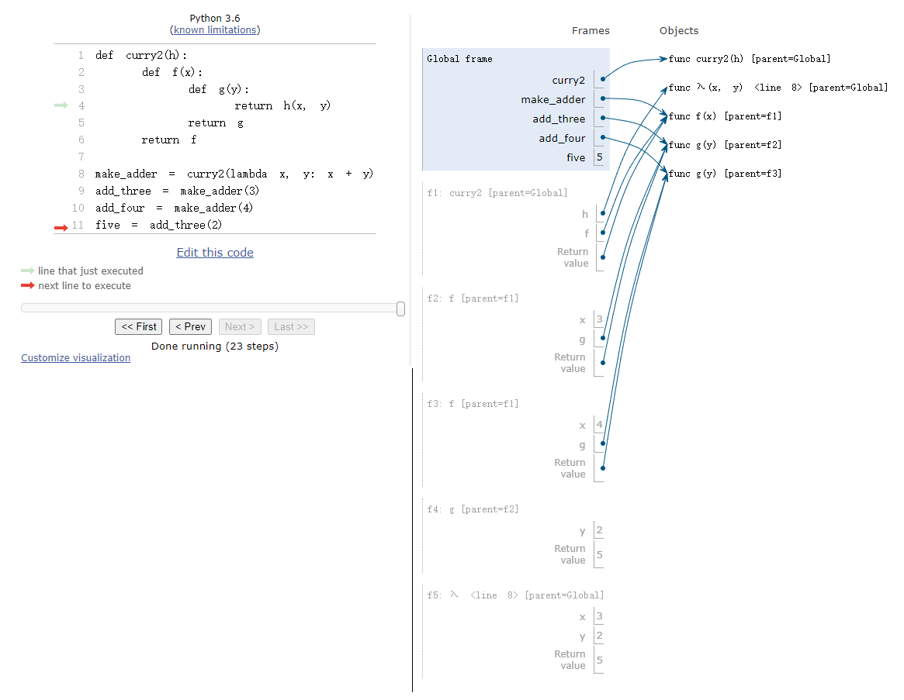

# CS61a DISC 2
Link to this section: https://inst.eecs.berkeley.edu/~cs61a/fa21/disc/disc02/#q3-curry2-lambda
## Q1: Make Keeper
Write a function that takes in a number n and returns a function that can take in a single parameter cond. When we pass in some condition function cond into this returned function, it will print out numbers from 1 to n where calling cond on that number returns True.


::: code-tabs#Q1
@tab Question
```
def keep_ints(cond, n):
    """
    Print out all integers 1..i..n where cond(i) is true
    >>> def is_even(x):
    ... # Even numbers have remainder 0 when divided by 2.
    ...     return x % 2 == 0
    >>> keep_ints(is_even, 5)
    2
    4
    """
    "*** YOUR CODE HERE ***"
```

@tab Answer
```
def keep_ints(cond, n):
    """
    Print out all integers 1..i..n where cond(i) is true
    >>> def is_even(x):
    ... # Even numbers have remainder 0 when divided by 2.
    ...     return x % 2 == 0
    >>> keep_ints(is_even, 5)
    2
    4
    """
    "*** YOUR CODE HERE ***"
    i = 1
    while i < n:
        if cond(i):
            print(i)
        i += 1

```
:::

## Q2: Curry2 Diagram
Draw the environment diagram that results from executing the code below.

::: code-tabs#Q2
@tab Question
```
def curry2(h):
    def f(x):
        def g(y):
            return h(x, y)
        return g
    return f

make_adder = curry2(lambda x, y: x + y)
add_three = make_adder(3)
add_four = make_adder(4)
five = add_three(2)

```

@tab Answer
```
Figure below

```
:::


## Q3: Curry2 Lambda
Write curry2 as a lambda function.

::: code-tabs#Q2
@tab Question
```
"*** YOUR CODE HERE ***"

```

@tab Answer
```
"*** YOUR CODE HERE ***"
return lambda x: lambda y: h(x, y)

```
:::

## Q4: Make Keeper Redux
In this question, we will build off of the make_keeper function from in Question 1.

The function make_keeper_redux is similar to make_keeper, but now the function returned by make_keeper_redux should be self-referential—i.e., the returned function should return a function with the same behavior as make_keeper_redux.

Feel free to paste and modify your code for make_keeper below.

::: info Hint
Hint: you only need to add ==one line== to your make_keeper solution. What is currently missing from make_keeper_redux?
:::

::: code-tabs#Q4
@tab Question
```
def make_keeper_redux(n):
    """Returns a function. This function takes one parameter <cond>
    and prints out all integers 1..i..n where calling cond(i)
    returns True. The returned function returns another function
    with the exact same behavior.

    >>> def multiple_of_4(x):
    ...     return x % 4 == 0
    >>> def ends_with_1(x):
    ...     return x % 10 == 1
    >>> k = make_keeper_redux(11)(multiple_of_4)
    4
    8
    >>> k = k(ends_with_1)
    1
    11
    >>> k
    <function do_keep>
    """
    # Paste your code for make_keeper here!

```

@tab Answer
```
def make_keeper_redux(n):
    """Returns a function. This function takes one parameter <cond>
    and prints out all integers 1..i..n where calling cond(i)
    returns True. The returned function returns another function
    with the exact same behavior.

    >>> def multiple_of_4(x):
    ...     return x % 4 == 0
    >>> def ends_with_1(x):
    ...     return x % 10 == 1
    >>> k = make_keeper_redux(11)(multiple_of_4)
    4
    8
    >>> k = k(ends_with_1)
    1
    11
    >>> k
    <function do_keep>
    """
    # Paste your code for make_keeper here!
    def cond(f):
        for i in range(1, n + 1):
            if(f(i)):
                print(i)
        return cond
    return cond

```
:::

## Q5: Print N
Draw the environment diagram that results from executing the code below.

::: code-tabs#Q5
@tab Question
```
def print_n(n):
    """
    >>> f = print_n(2)
    >>> f = f("hi")
    hi
    >>> f = f("hello")
    hello
    >>> f = f("bye")
    done
    >>> g = print_n(1)
    >>> g("first")("second")("third")
    first
    done
    done
    <function inner_print>
    """
    def inner_print(x):
        if ________________________
            print("done")
        else:
            print(x)
        return ____________________
    return ________________________


```

@tab Answer
```
def print_n(n):
    """
    >>> f = print_n(2)
    >>> f = f("hi")
    hi
    >>> f = f("hello")
    hello
    >>> f = f("bye")
    done
    >>> g = print_n(1)
    >>> g("first")("second")("third")
    first
    done
    done
    <function inner_print>
    """
    def inner_print(x):
        if n <= 0:
            print("done")
        else:
            print(x)
        return print_n(n-1)
    return inner_print


```
:::

## Q6: HOF Diagram Practice
Draw the environment diagram that results from executing the code below.

::: code-tabs#Q6
@tab Question
```
n = 7

def f(x):
    n = 8
    return x + 1

def g(x):
    n = 9
    def h():
        return x + 1
    return h

def f(f, x):
    return f(x + n)

f = f(g, n)
g = (lambda y: y())(f)

```

@tab Answer
```
自己跑一下pytutor吧
https://pythontutor.com/composingprograms.html#mode=display

```
:::


## Q7: YY Diagram
Draw the environment diagram that results from executing the code below.

::: code-tabs#Q7
@tab Question
```
y = "y"
h = y
def y(y):
    h = "h"
    if y == h:
        return y + "i"
    y = lambda y: y(h)
    return lambda h: y(h)
y = y(y)(y)

```

@tab Answer
```
同上

```
:::

## Q8: Match Maker
Implement match_k, which takes in an integer k and returns a function that takes in a variable x and returns True if all the digits in x that are k apart are the same.

For example, match_k(2) returns a one argument function that takes in x and checks if digits that are 2 away in x are the same.

match_k(2)(1010) has the value of x = 1010 and digits 1, 0, 1, 0 going from left to right. 1 == 1 and 0 == 0, so the match_k(2)(1010) results in True.

match_k(2)(2010) has the value of x = 2010 and digits 2, 0, 1, 0 going from left to right. 2 != 1 and 0 == 0, so the match_k(2)(2010) results in False.

Important: You may not use strings or indexing for this problem. You do not have to use all the lines, one staff solution does not use the line directly above the while loop.

::: info Hint
Hint: Floor dividing by powers of 10 gets rid of the rightmost digits.
:::

::: code-tabs#Q8
@tab Question
```
def match_k(k):
    """ Return a function that checks if digits k apart match

    >>> match_k(2)(1010)
    True
    >>> match_k(2)(2010)
    False
    >>> match_k(1)(1010)
    False
    >>> match_k(1)(1)
    True
    >>> match_k(1)(2111111111111111)
    False
    >>> match_k(3)(123123)
    True
    >>> match_k(2)(123123)
    False
    """
    ____________________________
        ____________________________
        while ____________________________:
            if ____________________________:
                return ____________________________
            ____________________________
        ____________________________
    ____________________________


```

@tab Answer
```
def match_k(k):
    """ Return a function that checks if digits k apart match

    >>> match_k(2)(1010)
    True
    >>> match_k(2)(2010)
    False
    >>> match_k(1)(1010)
    False
    >>> match_k(1)(1)
    True
    >>> match_k(1)(2111111111111111)
    False
    >>> match_k(3)(123123)
    True
    >>> match_k(2)(123123)
    False
    """
    def cal(x):
        i = x % 10**k
        while x > 0:
            if i != x % 10**k:
                return False
            x = x // 10**k
        return True
    return cal

```
:::

## Q9: Three Memory
A k-memory function takes in a single input, prints whether that input was seen exactly k function calls ago, and returns a new k-memory function. For example, a 2-memory function will display "Found" if its input was seen exactly two function calls ago, and otherwise will display "Not found".

Implement three_memory, which is a 3-memory function. You may assume that the value None is never given as an input to your function, and that in the first two function calls the function will display "Not found" for any valid inputs given.

::: code-tabs#Q9
@tab Question
```
def three_memory(n):
    """
    >>> f = three_memory('first')
    >>> f = f('first')
    Not found
    >>> f = f('second')
    Not found
    >>> f = f('third')
    Not found
    >>> f = f('second') # 'second' was not input three calls ago
    Not found
    >>> f = f('second') # 'second' was input three calls ago
    Found
    >>> f = f('third') # 'third' was input three calls ago
    Found
    >>> f = f('third') # 'third' was not input three calls ago
    Not found
    """
    def f(x, y, z):
        def g(i):
            if ____________________________:
                ____________________________
            else:
                ____________________________
            return ____________________________
        return ____________________________
    return f(None, None, n)


```

@tab Answer
```
def three_memory(n):
    """
    >>> f = three_memory('first')
    >>> f = f('first')
    Not found
    >>> f = f('second')
    Not found
    >>> f = f('third')
    Not found
    >>> f = f('second') # 'second' was not input three calls ago
    Not found
    >>> f = f('second') # 'second' was input three calls ago
    Found
    >>> f = f('third') # 'third' was input three calls ago
    Found
    >>> f = f('third') # 'third' was not input three calls ago
    Not found
    """
    def f(x, y, z):
        def g(i):
            if i == x:
                print('Found')
            else:
                print('Not found')
            return f(y, z, i)
        return g
    return f(None, None, n)


```
:::

## Q10: Natural Chain
For this problem, a chain_function is a higher order function that repeatedly accepts natural numbers (positive integers). The first number that is passed into the function that chain_function returns initializes a natural chain, which we define as a consecutive sequence of increasing natural numbers (i.e., 1, 2, 3). A natural chain breaks when the next input differs from the expected value of the sequence. For example, the sequence (1, 2, 3, 5) is broken because it is missing a 4.

Implement the chain_function so that it prints out the value of the expected number at each chain break as well as the number of chain breaks seen so far, including the current chain break. Each time the chain breaks, the chain restarts at the most recently input number.

For example, the sequence (1, 2, 3, 5, 6) would only print 4 and 1. We print 4 because there is a missing 4, and we print 1 because the 4 is the first number to break the chain. The 5 broke the chain and restarted the chain, so from here on out we expect to see numbers increasingly linearly from 5. See the doctests for more examples. You may assume that the higher-order function is never given numbers ≤ 0.

::: info Important
Important: For this problem, the starter code is a suggestion. You are welcome to add/delete/modify the starter code template, or even write your own solution that doesn’t use the starter code at all.
:::

::: code-tabs#Q10
@tab Question
```
def chain_function():
    """
    >>> tester = chain_function()
    >>> x = tester(1)(2)(4)(5) # Expected 3 but got 4, so print 3. 1st chain break, so print 1 too.
    3 1
    >>> x = x(2) # 6 should've followed 5 from above, so print 6. 2nd chain break, so print 2
    6 2
    >>> x = x(8) # The chain restarted at 2 from the previous line, but we got 8. 3rd chain break.
    3 3
    >>> x = x(3)(4)(5) # Chain restarted at 8 in the previous line, but we got 3 instead. 4th break
    9 4
    >>> x = x(9) # Similar logic to the above line
    6 5
    >>> x = x(10) # Nothing is printed because 10 follows 9.
    >>> y = tester(4)(5)(8) # New chain, starting at 4, break at 6, first chain break
    6 1
    >>> y = y(2)(3)(10) # Chain expected 9 next, and 4 after 10. Break 2 and 3.
    9 2
    4 3
    """
    def g(x, y):
        def h(n):
            if ____________________________:
                return ____________________________
            else:
                ____________________________
        return ____________________________
    return ____________________________

```

@tab Answer
```
def chain_function():
    """
    >>> tester = chain_function()
    >>> x = tester(1)(2)(4)(5) # Expected 3 but got 4, so print 3. 1st chain break, so print 1 too.
    3 1
    >>> x = x(2) # 6 should've followed 5 from above, so print 6. 2nd chain break, so print 2
    6 2
    >>> x = x(8) # The chain restarted at 2 from the previous line, but we got 8. 3rd chain break.
    3 3
    >>> x = x(3)(4)(5) # Chain restarted at 8 in the previous line, but we got 3 instead. 4th break
    9 4
    >>> x = x(9) # Similar logic to the above line
    6 5
    >>> x = x(10) # Nothing is printed because 10 follows 9.
    >>> y = tester(4)(5)(8) # New chain, starting at 4, break at 6, first chain break
    6 1
    >>> y = y(2)(3)(10) # Chain expected 9 next, and 4 after 10. Break 2 and 3.
    9 2
    4 3
    """
    def g(x, y):
        def h(n):
            if x == None:
                return g(n, 0)
            if n == x + 1:
                return g(n, y)
            else:
                print(x+1, y+1)
                return g(n, y+1)
        return h
    return g(None, 0)
```
:::


