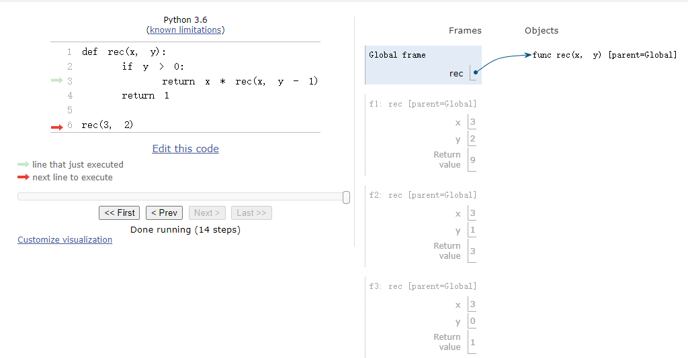

# CS61a DISC 3
# Recursion
Link to this section: <https://inst.eecs.berkeley.edu/~cs61a/fa21/disc/disc03/>
## Q1: Warm Up: Recursive Multiplication
These exercises are meant to help refresh your memory of the topics covered in lecture.

Write a function that takes two numbers m and n and returns their product. Assume m and n are positive integers. Use recursion, not mul or *.

::: info Hint
Hint: 5 * 3 = 5 + (5 * 2) = 5 + 5 + (5 * 1).
:::

::: code-tabs#Q1
@tab Question
```
def multiply(m, n):
    """ Takes two positive integers and returns their product using recursion.
    >>> multiply(5, 3)
    15
    """
    "*** YOUR CODE HERE ***"


```

@tab Answer
```
def multiply(m, n):
    """
    >>> multiply(5, 3)
    15
    """
    if n <= 0:
        return 0
    return m + multiply(m, n-1)
```
:::

## Q2: Recursion Environment Diagram
Draw an environment diagram for the following code:

::: code-tabs#Q2
@tab Question
```
def rec(x, y):
    if y > 0:
        return x * rec(x, y - 1)
    return 1

rec(3, 2)

```

:::


## Q3: Find the Bug

Find the bug with this recursive function.

::: code-tabs#Q3
@tab Question
```
def skip_mul(n):
    """Return the product of n * (n - 2) * (n - 4) * ...

    >>> skip_mul(5) # 5 * 3 * 1
    15
    >>> skip_mul(8) # 8 * 6 * 4 * 2
    384
    """
    if n == 2:
        return 2
    else:
        return n * skip_mul(n - 2)

```

@tab Answer
```
# Q3
def skip_mul(n):
    """Return the product of n * (n - 2) * (n - 4) * ...

    >>> skip_mul(5) # 5 * 3 * 1
    15
    >>> skip_mul(8) # 8 * 6 * 4 * 2
    384
    """
    if n <= 2:
        return n
    else:
        return n * skip_mul(n - 2)

```
:::

## Q4: Is Prime
Write a function is_prime that takes a single argument n and returns True if n is a prime number and False otherwise. Assume n > 1. We implemented this in Discussion 1 iteratively, now time to do it recursively!

::: info Hint
Hint: You will need a helper function! Remember helper functions are useful if you need to keep track of more variables than the given parameters, or if you need to change the value of the input.
:::

::: code-tabs#Q4
@tab Question
```
def is_prime(n):
    """Returns True if n is a prime number and False otherwise.

    >>> is_prime(2)
    True
    >>> is_prime(16)
    False
    >>> is_prime(521)
    True
    """
    "*** YOUR CODE HERE ***"

```

@tab Answer
```
def is_prime(n):
    """
    >>> is_prime(2)
    True
    >>> is_prime(16)
    False
    >>> is_prime(521)
    True
    """
    k = 2
    def prime_helper(n, k):
        if n == 2:
            return True
        elif n == 1 or n % k == 0:
            return False
        elif n // k <= k:
            return True
        else:
            return prime_helper(n, k+1)
    return prime_helper(n, k)

```
:::

## Q5: Recursive Hailstone
Recall the hailstone function from Homework 1. First, pick a positive integer n as the start. If n is even, divide it by 2. If n is odd, multiply it by 3 and add 1. Repeat this process until n is 1. Write a recursive version of hailstone that prints out the values of the sequence and returns the number of steps.

::: info Hint
Hint: When taking the recursive leap of faith, consider both the return value and side effect of this function.
:::

::: code-tabs#Q5
@tab Question
```
def hailstone(n):
    """Print out the hailstone sequence starting at n, and return the number of elements in the sequence.
    >>> a = hailstone(10)
    10
    5
    16
    8
    4
    2
    1
    >>> a
    7
    """
    "*** YOUR CODE HERE ***"

```

@tab Answer
```
def hailstone(n):
    """Print out the hailstone sequence starting at n, and return the
    number of elements in the sequence.
    >>> a = hailstone(10)
    10
    5
    16
    8
    4
    2
    1
    >>> a
    7
    """
    def f(n, times):
        print(n)
        if n == 1:
            return times
        if n % 2 == 0:
            n = n//2
        else:
            n = n * 3 + 1
        return f(n, times+1)
    return f(n, 1)

```
:::

## Q6: Merge Numbers
Write a procedure merge(n1, n2) which takes numbers with digits in decreasing order and returns a single number with all of the digits of the two, in decreasing order. Any number merged with 0 will be that number (treat 0 as having no digits). Use recursion.
::: info Hint
Hint: If you can figure out which number has the smallest digit out of both, then we know that the resulting number will have that smallest digit, followed by the merge of the two numbers with the smallest digit removed.
:::

::: code-tabs#Q6
@tab Question
```
def merge(n1, n2):
    """ Merges two numbers by digit in decreasing order
    >>> merge(31, 42)
    4321
    >>> merge(21, 0)
    21
    >>> merge (21, 31) 
    3211
    """
    "*** YOUR CODE HERE ***"
```

@tab Answer
```
def merge(n1, n2):
    """ Merges two numbers
    >>> merge(31, 42)
    4321
    >>> merge(21, 0)
    21
    >>> merge (21, 31)
    3211
    """
    if n1 == 0:
        return n2
    elif n2 == 0:
        return n1
    elif n1 % 10 < n2 % 10:
        return merge(n1 // 10, n2) * 10 + n1 % 10
    else:
        return merge(n1, n2 // 10) * 10 + n2 % 10
```
:::

