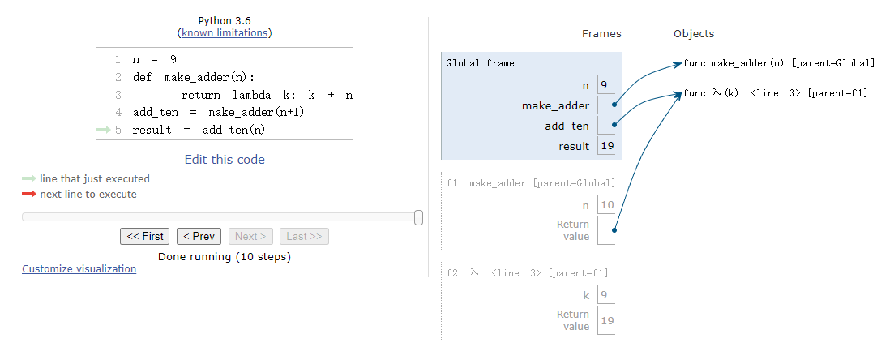

# CS61a Lab 2
# Higher-Order Functions, Lambda Expressions
Link to this section: <https://inst.eecs.berkeley.edu/~cs61a/fa20/lab/lab02/>
## Q1: WWPD: Lambda the Free
Write a function that takes in a number n and returns a function that can take in a single parameter cond. When we pass in some condition function cond into this returned function, it will print out numbers from 1 to n where calling cond on that number returns True.

::: code-tabs#Q1
@tab Suite 1
```
---------------------------------------------------------------------
Lambda the Free > Suite 1 > Case 1
(cases remaining: 7)

Q: Which of the following statements describes a difference between a def statement
and a lambda expression?
Choose the number of the correct choice:
0) A def statement can only have one line in its body.
1) A lambda expression cannot have more than two parameters.
2) A lambda expression does not automatically bind the function object that it returns to any name.
3) A lambda expression cannot return another function.
choose: 2)

---------------------------------------------------------------------
Lambda the Free > Suite 1 > Case 2
(cases remaining: 6)

Q: How many parameters does the following lambda expression have?
lambda a, b: c + d
Choose the number of the correct choice:
0) Not enough information
1) two
2) three
3) one
choose: 1)

---------------------------------------------------------------------
Lambda the Free > Suite 1 > Case 3
(cases remaining: 5)

Q: When is the return expression of a lambda expression executed?
Choose the number of the correct choice:
0) When the lambda expression is evaluated.
1) When you pass the lambda expression into another function.
2) When the function returned by the lambda expression is called.
3) When you assign the lambda expression to a name.
choose: 2)

```

@tab Suite 2.0
```
---------------------------------------------------------------------
Lambda the Free > Suite 2 > Case 1
(cases remaining: 4)

What would Python display? If you get stuck, try it out in the Python
interpreter!

>>> # If Python displays <function...>, type Function, if it errors type Error
>>> lambda x: x  # A lambda expression with one parameter x
? Function
-- OK! --

>>> a = lambda x: x  # Assigning a lambda function to the name a
>>> a(5)
? 5
-- OK! --

>>> (lambda: 3)()  # Using a lambda expression as an operator in a call exp.
? 3
-- OK! --

>>> b = lambda x: lambda: x  # Lambdas can return other lambdas!
>>> c = b(88)
>>> c
? Function
-- OK! --

>>> c()
? 88
-- OK! --

>>> d = lambda f: f(4)  # They can have functions as arguments as well
>>> def square(x):
...     return x * x
>>> d(square)
? 16
-- OK! --

---------------------------------------------------------------------
Lambda the Free > Suite 2 > Case 2
(cases remaining: 3)

What would Python display? If you get stuck, try it out in the Python
interpreter!

>>> x = None # remember to review the rules of WWPD given above!
>>> x
>>> lambda x: x
? Function
-- OK! --

```

@tab Suite 2.1
```
---------------------------------------------------------------------
Lambda the Free > Suite 2 > Case 3
(cases remaining: 2)

What would Python display? If you get stuck, try it out in the Python
interpreter!

>>> #
>>> # Pay attention to the scope of variables
>>> z = 3
>>> e = lambda x: lambda y: lambda: x + y + z
>>> e(0)(1)()
? 4
-- OK! --

>>> f = lambda z: x + z
>>> f(3)
? error
-- OK! --

---------------------------------------------------------------------
Lambda the Free > Suite 2 > Case 4
(cases remaining: 1)

What would Python display? If you get stuck, try it out in the Python
interpreter!

>>> # Try drawing an environment diagram if you get stuck!
>>> higher_order_lambda = lambda f: lambda x: f(x)
>>> g = lambda x: x * x
>>> higher_order_lambda(2)(g) # Which argument belongs to which function call?
? error
-- OK! --

>>> higher_order_lambda(g)(2)
? 4
-- OK! --

>>> call_thrice = lambda f: lambda x: f(f(f(x)))
>>> call_thrice(lambda y: y + 1)(0)
? 3
-- OK! --

>>> print_lambda = lambda z: print(z)
>>> print_lambda
? Function
-- OK! --

>>> one_thousand = print_lambda(1000)
? 1000
-- OK! --

>>> one_thousand
? nothing
-- OK! --

```
:::


## Q2: WWPD: Higher Order Functions
::: info Hint
Use Ok to test your knowledge with the following "What Would Python Display?" questions:

python ok -q hof-wwpd -u --local

For all WWPD questions, type Function if you believe the answer is <function...>, Error if it errors, and Nothing if nothing is displayed.
:::

::: code-tabs#Q2
@tab Suite 1.0
```
---------------------------------------------------------------------
Higher Order Functions > Suite 1 > Case 1
(cases remaining: 2)

What would Python display? If you get stuck, try it out in the Python
interpreter!

>>> def even(f):
...     def odd(x):
...         if x < 0:
...             return f(-x)
...         return f(x)
...     return odd
>>> steven = lambda x: x
>>> stewart = even(steven)
>>> stewart
? Function
-- OK! --

>>> stewart(61)
? 61
-- OK! --

>>> stewart(-4)
? 4
-- OK! --
```

@tab Suite 1.1
```
---------------------------------------------------------------------
Higher Order Functions > Suite 1 > Case 2
(cases remaining: 1)

What would Python display? If you get stuck, try it out in the Python
interpreter!

>>> def cake():
...    print('beets')
...    def pie():
...        print('sweets')
...        return 'cake'
...    return pie
>>> chocolate = cake()
? beets
-- OK! --

>>> chocolate
? Function
-- OK! --

>>> chocolate()
(line 1)? sweets
(line 2)? 'cake'
-- OK! --

>>> more_chocolate, more_cake = chocolate(), cake
? sweets
-- OK! --

>>> more_chocolate
? 'cake'
-- OK! --

>>> def snake(x, y):
...    if cake == more_cake:
...        return chocolate
...    else:
...        return x + y
>>> snake(10, 20)

? Function
-- OK! --

>>> snake(10, 20)()
(line 1)? sweets
(line 2)? 'cake'
-- OK! --

>>> cake = 'cake'
>>> snake(10, 20)
? 30
-- OK! --

```
:::

## Q3: Lambdas and Currying
We can transform multiple-argument functions into a chain of single-argument, higher order functions by taking advantage of lambda expressions. For example, we can write a function f(x, y) as a different function g(x)(y). This is known as currying. It's useful when dealing with functions that take only single-argument functions. We will see some examples of these later on.

Write a function lambda_curry2 that will curry any two argument function using lambdas. Refer to the textbook for more details about currying.

Your solution to this problem should fit entirely on the return line. You can try writing it first without this restriction, but rewrite it after in one line.

::: code-tabs#Q3
@tab Question
```
def lambda_curry2(func):
    """
    Returns a Curried version of a two-argument function FUNC.
    >>> from operator import add, mul, mod
    >>> curried_add = lambda_curry2(add)
    >>> add_three = curried_add(3)
    >>> add_three(5)
    8
    >>> curried_mul = lambda_curry2(mul)
    >>> mul_5 = curried_mul(5)
    >>> mul_5(42)
    210
    >>> lambda_curry2(mod)(123)(10)
    3
    """
    "*** YOUR CODE HERE ***"
    return ______

```

@tab Answer
```
def lambda_curry2(func):
    """
    Returns a Curried version of a two-argument function FUNC.
    >>> from operator import add, mul, mod
    >>> curried_add = lambda_curry2(add)
    >>> add_three = curried_add(3)
    >>> add_three(5)
    8
    >>> curried_mul = lambda_curry2(mul)
    >>> mul_5 = curried_mul(5)
    >>> mul_5(42)
    210
    >>> lambda_curry2(mod)(123)(10)
    3
    """
    "*** YOUR CODE HERE ***"
    return lambda x: lambda y: func(x, y)

```
:::

## Q4: Count van Count
Consider the following implementations of count_factors and count_primes:

::: code-tabs#Q4
@tab Question
```
def count_cond(condition):
    """Returns a function with one parameter N that counts all the numbers from
    1 to N that satisfy the two-argument predicate function Condition, where
    the first argument for Condition is N and the second argument is the
    number from 1 to N.

    >>> count_factors = count_cond(lambda n, i: n % i == 0)
    >>> count_factors(2)   # 1, 2
    2
    >>> count_factors(4)   # 1, 2, 4
    3
    >>> count_factors(12)  # 1, 2, 3, 4, 6, 12
    6

    >>> is_prime = lambda n, i: count_factors(i) == 2
    >>> count_primes = count_cond(is_prime)
    >>> count_primes(2)    # 2
    1
    >>> count_primes(3)    # 2, 3
    2
    >>> count_primes(4)    # 2, 3
    2
    >>> count_primes(5)    # 2, 3, 5
    3
    >>> count_primes(20)   # 2, 3, 5, 7, 11, 13, 17, 19
    8
    """
    "*** YOUR CODE HERE ***"

```

@tab Answer
```
def count_cond(condition):
    """Returns a function with one parameter N that counts all the numbers from
    1 to N that satisfy the two-argument predicate function Condition, where
    the first argument for Condition is N and the second argument is the
    number from 1 to N.

    >>> count_factors = count_cond(lambda n, i: n % i == 0)
    >>> count_factors(2)   # 1, 2
    2
    >>> count_factors(4)   # 1, 2, 4
    3
    >>> count_factors(12)  # 1, 2, 3, 4, 6, 12
    6

    >>> is_prime = lambda n, i: count_factors(i) == 2
    >>> count_primes = count_cond(is_prime)
    >>> count_primes(2)    # 2
    1
    >>> count_primes(3)    # 2, 3
    2
    >>> count_primes(4)    # 2, 3
    2
    >>> count_primes(5)    # 2, 3, 5
    3
    >>> count_primes(20)   # 2, 3, 5, 7, 11, 13, 17, 19
    8
    """
    "*** YOUR CODE HERE ***"
    def cal(n):
        list = []
        for i in range(1, n+1):
            if(condition(n, i)):
                list.append(i)
        return list.__len__()
    return cal

```
:::

## Q5: Make Adder
Draw the environment diagram for the following code:

::: code-tabs#Q5
@tab Question
```
n = 9
def make_adder(n):
    return lambda k: k + n
add_ten = make_adder(n+1)
result = add_ten(n)

```
:::




## Q6: Lambda the Environment Diagram
Try drawing an environment diagram for the following code and predict what Python will output.

You do not need to submit or unlock this question through Ok. Instead, you can check your work with the Online Python Tutor, but try drawing it yourself first!

::: code-tabs#Q
@tab Question
```
>>> a = lambda x: x * 2 + 1
>>> def b(b, x):
...     return b(x + a(x))
>>> x = 3
>>> b(a, x)
______

```

@tab Answer
```
>>> a = lambda x: x * 2 + 1
>>> def b(b, x):
...     return b(x + a(x))
>>> x = 3
>>> b(a, x)
21

```
:::

[!Alt][../source/L2Q6.png]

## Q7: Composite Identity Function
Write a function that takes in two single-argument functions, f and g, and returns another function that has a single parameter x. The returned function should return True if f(g(x)) is equal to g(f(x)). You can assume the output of g(x) is a valid input for f and vice versa. Try to use the compose1 function defined below for more HOF practice.

::: code-tabs#Q7
@tab Question
```
def compose1(f, g):
    """Return the composition function which given x, computes f(g(x)).

    >>> add_one = lambda x: x + 1        # adds one to x
    >>> square = lambda x: x**2
    >>> a1 = compose1(square, add_one)   # (x + 1)^2
    >>> a1(4)
    25
    >>> mul_three = lambda x: x * 3      # multiplies 3 to x
    >>> a2 = compose1(mul_three, a1)    # ((x + 1)^2) * 3
    >>> a2(4)
    75
    >>> a2(5)
    108
    """
    return lambda x: f(g(x))

def composite_identity(f, g):
    """
    Return a function with one parameter x that returns True if f(g(x)) is
    equal to g(f(x)). You can assume the result of g(x) is a valid input for f
    and vice versa.

    >>> add_one = lambda x: x + 1        # adds one to x
    >>> square = lambda x: x**2
    >>> b1 = composite_identity(square, add_one)
    >>> b1(0)                            # (0 + 1)^2 == 0^2 + 1
    True
    >>> b1(4)                            # (4 + 1)^2 != 4^2 + 1
    False
    """
    "*** YOUR CODE HERE ***"

```

@tab Answer
```
def compose1(f, g):
    """Return the composition function which given x, computes f(g(x)).

    >>> add_one = lambda x: x + 1        # adds one to x
    >>> square = lambda x: x**2
    >>> a1 = compose1(square, add_one)   # (x + 1)^2
    >>> a1(4)
    25
    >>> mul_three = lambda x: x * 3      # multiplies 3 to x
    >>> a2 = compose1(mul_three, a1)    # ((x + 1)^2) * 3
    >>> a2(4)
    75
    >>> a2(5)
    108
    """
    return lambda x: f(g(x))

def composite_identity(f, g):
    """
    Return a function with one parameter x that returns True if f(g(x)) is
    equal to g(f(x)). You can assume the result of g(x) is a valid input for f
    and vice versa.

    >>> add_one = lambda x: x + 1        # adds one to x
    >>> square = lambda x: x**2
    >>> b1 = composite_identity(square, add_one)
    >>> b1(0)                            # (0 + 1)^2 == 0^2 + 1
    True
    >>> b1(4)                            # (4 + 1)^2 != 4^2 + 1
    False
    """
    "*** YOUR CODE HERE ***"
    def cal(x):
        return g(x) ** 2 == f(x) + 1
    return cal


```
:::

## Q8: I Heard You Liked Functions...
Define a function cycle that takes in three functions f1, f2, f3, as arguments. cycle will return another function that should take in an integer argument n and return another function. That final function should take in an argument x and cycle through applying f1, f2, and f3 to x, depending on what n was. Here's what the final function should do to x for a few values of n:

n = 0, return x
n = 1, apply f1 to x, or return f1(x)
n = 2, apply f1 to x and then f2 to the result of that, or return f2(f1(x))
n = 3, apply f1 to x, f2 to the result of applying f1, and then f3 to the result of applying f2, or f3(f2(f1(x)))
n = 4, start the cycle again applying f1, then f2, then f3, then f1 again, or f1(f3(f2(f1(x))))
And so forth.

::: info Hint
Hint: most of the work goes inside the most nested function.
:::

::: code-tabs#Q8
@tab Question
```
def cycle(f1, f2, f3):
    """Returns a function that is itself a higher-order function.

    >>> def add1(x):
    ...     return x + 1
    >>> def times2(x):
    ...     return x * 2
    >>> def add3(x):
    ...     return x + 3
    >>> my_cycle = cycle(add1, times2, add3)
    >>> identity = my_cycle(0)
    >>> identity(5)
    5
    >>> add_one_then_double = my_cycle(2)
    >>> add_one_then_double(1)
    4
    >>> do_all_functions = my_cycle(3)
    >>> do_all_functions(2)
    9
    >>> do_more_than_a_cycle = my_cycle(4)
    >>> do_more_than_a_cycle(2)
    10
    >>> do_two_cycles = my_cycle(6)
    >>> do_two_cycles(1)
    19
    """
    "*** YOUR CODE HERE ***"

```

@tab Answer
```
def cycle(f1, f2, f3):
    """Returns a function that is itself a higher-order function.

    >>> def add1(x):
    ...     return x + 1
    >>> def times2(x):
    ...     return x * 2
    >>> def add3(x):
    ...     return x + 3
    >>> my_cycle = cycle(add1, times2, add3)
    >>> identity = my_cycle(0)
    >>> identity(5)
    5
    >>> add_one_then_double = my_cycle(2)
    >>> add_one_then_double(1)
    4
    >>> do_all_functions = my_cycle(3)
    >>> do_all_functions(2)
    9
    >>> do_more_than_a_cycle = my_cycle(4)
    >>> do_more_than_a_cycle(2)
    10
    >>> do_two_cycles = my_cycle(6)
    >>> do_two_cycles(1)
    19
    """
    "*** YOUR CODE HERE ***"
    def f(n, x):
        if n == 0:
            return x
        elif n % 3 == 1:
            return f1(f(n-1, x))
        elif n % 3 == 2:
            return f2(f(n-1, x))
        else:
            return f3(f(n-1, x))

    def g(n):
        def h(x):
            return f(n, x)
        return h
    return g

```
:::

